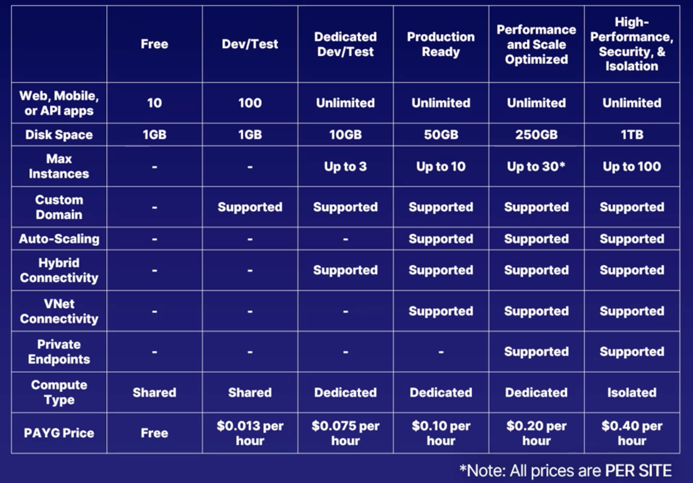

# AZ-204 AZ Fundamentals

## Chapter 2 - Working with Azure Compute

### Powershell Az.Compute Module

- `New-AzVM` spins up a new virtual machine

### Arm Templates

`
{
"$schema": "http://schema.management. azure.com/schemas/2019-04- 01/deploymentTemplate.json#",
"contentVersion": "1.0.0.0",
"parameters": {},
"variables": {},
"resources": [],
"outputs": {}
}
`

- Schema, contentVersion and resources are required. Everything else is optional

### Creating a container
Azure CLI
`
az container create \
--resource-group Azurerg \
--name container-name \
--image <path to image> \
--dns-name-label azure-container \
--ports 80
`

Powershell
`
New-AzContainerGroup
-ResourceGroupName Azurerg
-Name container-name
-Image <path to image>
-OsType Windows
-DnsNameLabel azure-container
`

- In powershell, unless specified you'd default to port 80

- Container Group - All of the dependencies that the container needs to function

#### Azure container registry

- Like Docker Hub for images used in containers
- You host one on your azure account by creating a "Registry". There are Basic, Standard and Premium. You can lock it to avoid overwriting images, and to controll access.

Azure CLI - Create
`
az acr create \
--resource-group Azurerg \
--name registry-name \
--sku Basic
`

- Name should be unique across Azure

Azure CLI - Login
`
az acr login \
--name registry-name
`

Push an image
`
docker tag <path to image>/<image> <login server (from output)>/<imagename>:v1
docker push <imagename>:v1
`

### App Services

Knowledge exam requires

- Create App Service web app
- Enable Diagnostics
- Deploy code to web app
- Configure setting such as SSL, API, connection strings
- Implement auto-scaling rules

#### App Service web app

- We need to know what we make before we make it.
- Have to pick a language - ASP.Net, PHP, Java, Python.. etc. as well as custom containers.
- Know an SKU to run

- Have to commit this diagram to memory for the exam

